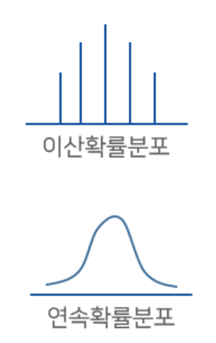

## **확률변수와 확률분포** \
\

#### **확률변수**\
확률적으로 서로 다른 값을 가질 수 있는 어떤 변수 \
\
**- 이산확률변수** \
확률변수 X가 취할 수 있는 값이 불연속일 때 \
**- 연속확률변수** \
확률변수 X가 취할 수 있는 값이 연속일 때\
\

#### **확률분포**\
확률변수 X가 갖느 값과 X가 이 값을 가질 확률 사이의 대응 관계(함수) \
\
**이산확률분포** \
이산확률변수에 대한 확률질량함수(PM(Mass)F) \
**연속확률분포** \
연속확률변수에 대한 확률밀도함수(PD(Density)F) \
\
\

\
\

#### **정규분포** \
확률밀도함수를 그래프로 그렸을 때 종형 곡선이 나타나는 확률분포 \
*N(m, o^2)* : 평균이 m 표준편차가 o인 정규분포 \
\

#### **표준정규분포** \
*N(0, 1)* : 평균이 0 , 표준편차가 1인 정규분포 \
\
\

\
\

#### **정규분포의 유용성** \
다양한 사회 현상, 자연 현상에 대한 우리의 직관과 부합하는 특성을 가짐 \
\

#### **정규분포의 특성** \
**- 기댓값** \
데이터의 분포를 숫자 하나로 요약할 수 있음 \
**- 표준편차** \
: 평균에서 자료가 떨어져 있는지를 나타내는  \
- 표준편차가 클수록 그래프는 작고 납작해짐 \
- 표준편차가 작을수록 그래프는 높고 뾰족해짐 \
\

#### **pnorm함수(누적분포함수)** \
정규분포의 평균과 표준편차를 알고있을 때 q값이 정규분포 안에 있을 확률을 알고 싶을 때 \
pnorm(q, mean, sd) \
- q : 찾고싶은 값 \
- mean : 평균 값 \
- sd : 표준편차 \
\

- q_1과 q_2 사이에 있을 확률을 구하고 싶을 때(q_1 > q_2) \
pnorm(q_1, mean, sd) - 
pnorm(q_2, mean, sd) \
\
- q_2보다 작을 확률 \
pnorm(q_2, mean, sd) \
\
- q_1보다 클 확률 \
1 - pnorm(q_1, mean, sd) \
\

###### *ploygon 함수
###### plot 함수에서 특정 부분을 색칠할 수 있는 함수 \
\

#### **표준화(정규화)** \
정규분포를 따르는 확률변수 X를 표준정규분포를 따르는 확률변수 Z로 변환\
*X~N(m,o^2) -> Z = (X-m)/o, Z~N(0,1)\
**표준화를 하는 이유** \
평균과 표준편차가 다른 정규분포를 따르는 두 변수의 값을 비교하는 경우 \
\

#### **dnorm함수(확률밀도함수)** \
dnorm(q, mean, sd) \
- x : 찾고싶은 값 \
- mean : 평균 값 \
- sd : 표준편차 \
\

#### **dnorm함수(확률밀도함수)** \
dnorm(q, mean, sd) \
- x : 찾고싶은 값 \
- mean : 평균 값 \
- sd : 표준편차 \
\

#### **이항 분포** \
어떤 시행에서 사건이 일어날 확률이 𝑝인 독립시행을 𝑛회 반복할 때 \
사건이 일어나는 횟수인 확률변수 𝑋는 이항분포 𝐵(𝑛, 𝑝)를 따른다. \
*- 𝑋~𝐵(𝑛, 𝑝)* \
\

###### plot 함수에서 add = T를 적으면 앞의 plot에 추가되어 나타난다. \
\

###### set.seed(n)함수를 통해서 변수 결과를 n으로 고정시킨다. \
\

### **확률분포 관련 R 함수** \
\
\
\
random : 난수 / density : 확률 / probability : 누적 / quantile: 백분위 \

\
- **균일분포** : 특정 범위 내에서 균등하게 나타나는 확률을 가지는 확률분포 \
- **이항분포** : 임의의 시행 결과가 성공 또는 실패 중 하나인 시행 \
- **정규분포** : 자연현상 또는 사회현상에서 자주 관찰되는 종 모양의 확률분포\
- **표준 정규분포** : 평균이 0이고 표준편차가 1인 정규분포 \
\

### **정규분포의 확률과 확률변수 값 사이 관계** 
- 90%(α = 0.01) ↔ 1.645 \
- 95%(α = 0.05) ↔ 1.96 \
- 99%(α = 0.01) ↔ 2.576 \
\

### **정규분포를 따르는 확률변수의 값은 𝜇 ± 1.96 × 𝜎 범위 안에 있을 확률이 약 95%이다.** \
\

#### **모집단과 표본집단** \
- 모집단 : 전체집단 \
- 표본집단 : 모집단에서 추출한 부분 집합 \
\

#### **sample함수** \
sample(x, size) \
x : 모집단 \
size : 샘플링 횟수 \
replace : True(복원추출) \
\

#### **중심극한정리** \
**표본의 크기가 충분히 클 때(n ≥ 30)** \
표본분포는 모집단의 분포와 상관없이 정규분포를 따른다. \

